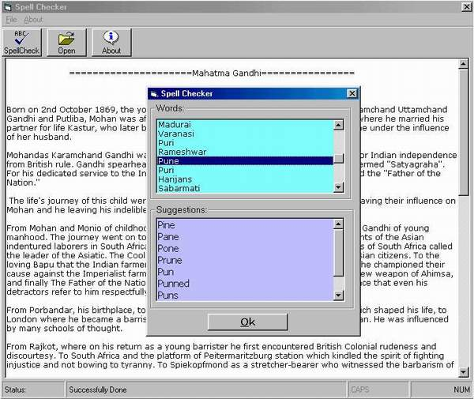



## AA \*\*\*Making an Spelling Checker with VB and Word Updated

### Description

One of Word's most commonly used features is the ability to check spelling. Word encapusulates this functionality into two methods: CheckSpelling and GetSpellingSuggestions. The GetSpellingSuggestions method is memember function of the Application and range object in Word. CheckSpelling is a member function of Application, Range, and Document object.we can use CheckSpelling to determine whether a word is spelled correctly. If a word is misspelled, we can use the

GetSpellingSuggestions method to retune a collection of

SpellingSuggestion object for the misspelled word.

This program also have a good example of using StatusBar, imagelist and toolbar

A vary nice program for Beginners.

You must see Screen shot of this program
 
### More Info
 

             |
---                |---
**Submitted On**   |2001-01-26 13:06:10
**By**             |[Suresh Singh](https://github.com/Planet-Source-Code/PSCIndex/blob/master/ByAuthor/suresh-singh.md)
**Level**          |Beginner
**User Rating**    |4.9 (34 globes from 7 users)
**Compatibility**  |VB 6\.0
**Category**       |[Microsoft Office Apps/VBA](https://github.com/Planet-Source-Code/PSCIndex/blob/master/ByCategory/microsoft-office-apps-vba__1-42.md)
**World**          |[Visual Basic](https://github.com/Planet-Source-Code/PSCIndex/blob/master/ByWorld/visual-basic.md)
**Archive File**   |[CODE\_UPLOAD141901262001\.zip](https://github.com/Planet-Source-Code/suresh-singh-aa-making-an-spelling-checker-with-vb-and-word-updated__1-14657/archive/master.zip)

